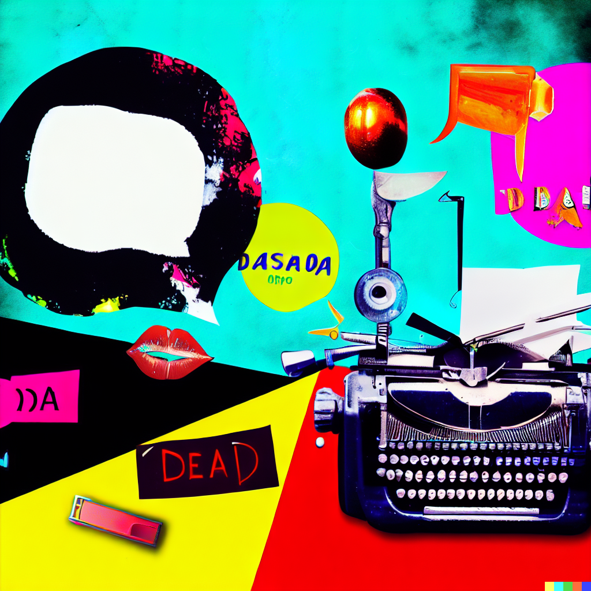

## transcript

In the following video, we're going to be taking a look at poetry and the alphabet dying because of large language models, and if that's actually going to be a thing that we should worry about as a species going forward with this kind of technology, like what's going to happen to the foundations of our language and what's worth keeping and what can we live without. So we're going to be examining that in this video. The companion piece will be in the description below if you want to check that out. So make sure to sign up for the newsletter and subscribe and stick around because we're about to get into it and the ending is pretty cool. All right. Have a good one.

## result

Title: 
Is AI Killing Poetry and the Alphabet? 

Description: 
Join us as we explore the potential consequences of large language models on our language, culture and identity. What aspects of language are worth preserving and what can we do without? Watch till the end for an exciting surprise! Don't forget to check out our companion piece in the description below and subscribe to our newsletter for more fascinating content. 

AI Art Prompt: 
Create a piece of art inspired by the Dada movement, exploring the absurdity of language and the impact of technology on human expression.

*example dalle creations from exact prompt*

